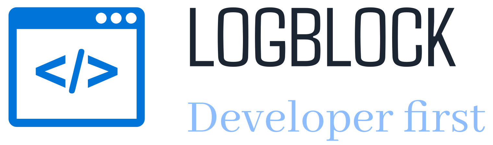

<!-- PROJECT SHIELDS -->
[![GPLv3 License][license-shield]][license-url]

<!-- PROJECT LOGO -->
<br />

<div align="center">
  <a href="https://github.com/jonshung/LogBlock">
     
  </a>

  <h3 align=center> 📖 LogBlock: the developer-centric social media platform  </h3>
  LogBlock is designed to provide a better design and information flows for a platform where code sharing is easier than ever!

  </br>
</div>


<i>Currently, this project only consists of engineering design and implementation is not completed. However, everyone is free to submit changes if felt suited :).</i>


### Built With

* [![Next][Next.js]][Next-url]
* [![Spring boot][Spring-boot]][Spring-boot-url]
* [![Docker][Docker]][Docker-url]
* [![PostgreSQL][PostgreSQL]][PostgreSQL-url]
* [![Tailwind][Tailwind]][Tailwind-url]

<!-- GETTING STARTED -->
## 📜 Prerequisites

- Docker (preferably the latest version).

## ⚙️ Configuration

<h3 align=center> 🖇️ Components linking </h3>

In order for the three main components of a LogBlock unit to work, they must know where to look for the required depending processes.
</br>

Each component's hostname and port can be customized in the docker compose `compose.yaml` file. Mount source for database storage can be changed via the `volume` section, under the `db-data` unit. It is advised that the location has already existed before Docker is run. Mount destination is best to keep to default.
</br>

> <i>Be careful, since this is only an early stage implementation of the project, certain security aspect (such as setting environment variables directly in a docker compose file) can strictly weaken the system and should not be used in production.</i>

<h3 align=center> 🌑 Back-end customization and linking </h3>

Individual components must also know where their dependencies are using environment variables. Automatic bindpoint generation is not supported at the moment.
</br>

Back-end component can be switch to `development` mode by setting `development` in the `BUILD_TYPE` field. `development` mode allows developers to profile dependencies injection order and monitor for extensive Spring-related errors.
</br>

At `src/back-end/.env`, the current necessary credentials matching those that were set in the `compose.yml` file are listed. Oauth authentication can only be supported once both `OAUTH_GOOGLE_CLIENT_ID` and `OAUTH_GOOGLE_CLIENT_SECRET` is set.

<h3 align=center> ☀️ front-end customization and linking </h3>

Similarly, component linking must also be set in the `front-end`'s environment variables. The variable `ENABLE_AUTH_GUARD` can be used to enable Oauth authentication on the front-end. `back-end` requires an authentication token retrieved through the `SESSION_TOKEN` cookie, which can also be disabled by starting the `back-end` in `development` mode.

## 📦 Building

The project can simply be built using the provided compose file:
```console
$ docker compose up --build --force-recreate
```
Which will always rebuild the component images and start the components. If that is not desired, remove the `--force-recreate` flag.
</br>

The created images are as minimal as possible, and dependencies are only needed during build stage, which are destroyed after the system is fired up.

## 🖼️ Usage

The project can easily be fired up through the same docker compose file used during the initiation process.

<div align=center>
  <a href="https://github.com/jonshung/LogBlock">
    
  </a>
</div>

<!-- CONTRIBUTING -->
## 🎉 Contributing

Since this is a academic project resource, I do not anticipate additional contribution to the repo. But if you have a suggestion that would make this better, please fork the repo and create a pull request. I'll try to allocate time to review and push the changes as soon as possible.

<!-- LICENSE -->
## 📑 License

Distributed under the GPLv3 License. See `LICENSE` for more information.

<!-- CONTACT -->
## 🔎 Contact

[![LinkedIn][linkedin-shield]][linkedin-url-hung]
<br/>
<p>Hung, Ngu Kiet (jonshung) - nkhung22@clc.fitus.edu.vn</p>

---

Long, Nguyen The Thanh - nttlong22@clc.fitus.edu.vn

---

An, Trinh Cao - tcan22@clc.fitus.edu.vn

---

Long, Tran Thanh - ttlong22@clc.fitus.edu.vn

---

Cuong, Tran Nguyen Nhat - tnncuong22@clc.fitus.edu.vn


<!-- MARKDOWN LINKS & IMAGES -->
<!-- https://www.markdownguide.org/basic-syntax/#reference-style-links -->
[license-shield]: https://www.gnu.org/graphics/gplv3-127x51.png
[license-url]: https://www.gnu.org/licenses/gpl-3.0.html
[linkedin-shield]: https://img.shields.io/badge/-LinkedIn-blue?style=flat-square&logo=Linkedin&logoColor=white
[linkedin-url-hung]: https://www.linkedin.com/in/jonshung/

[Next.js]: https://img.shields.io/badge/next.js-000000?style=for-the-badge&logo=nextdotjs&logoColor=white
[Next-url]: https://nextjs.org/
[Spring-boot]: https://img.shields.io/badge/SpringBoot-6DB33F?style=for-the-badge&logo=Spring&logoColor=whitestyle=for-the-badge&logo=spring-boot
[Spring-boot-url]: https://github.com/spring-projects/spring-boot
[Docker]: https://img.shields.io/badge/docker-257bd6?style=for-the-badge&logo=docker&logoColor=white
[Docker-url]: https://www.docker.com/
[PostgreSQL]: https://img.shields.io/badge/postgresql-4169e1?style=for-the-badge&logo=postgresql&logoColor=white
[PostgreSQL-url]: https://www.postgresql.org/
[Tailwind]: https://img.shields.io/badge/-Tailwind%20CSS-%231a202c?style=for-the-badge&logo=tailwind-css
[Tailwind-url]: https://tailwindcss.com/